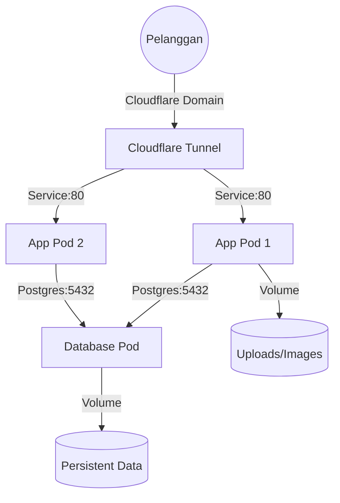
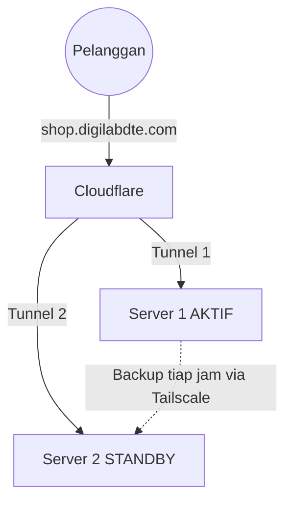

# Panduan Operasional DigiShop Kubernetes

## 📝 Ringkasan Proyek
**DigiShop** adalah aplikasi Toko Digital yang berjalan di atas infrastruktur **Kubernetes (KIND)**. Sistem ini dirancang untuk keandalan tinggi dengan fitur:
- **Zero Downtime**: Update aplikasi tanpa gangguan layanan.
- **Self-Healing**: Otomatis memperbaiki container yang rusak.
- **Auto-Sync**: Sinkronisasi kode instan saat proses pengembangan.

## 🏗️ Arsitektur Sistem


---

## 🛠️ Alat Manajemen: `manage-k8s.sh`
Kami menyediakan skrip bantu untuk mengelola seluruh ekosistem DigiShop. Gunakan `./manage-k8s.sh [command]` dari terminal.

### 1. Monitoring & Debugging
| Command | Kegunaan |
| :--- | :--- |
| `./manage-k8s.sh status` | Melihat status kesehatan semua pod (App, DB, Tunnel). |
| `./manage-k8s.sh logs app` | Memantau log aktivitas aplikasi (Error, Login, dll). |
| `./manage-k8s.sh logs db` | Memantau log aktivitas database PostgreSQL. |
| `./manage-k8s.sh app-shell` | Masuk ke terminal di dalam kontainer Aplikasi. |
| `./manage-k8s.sh db-shell` | Masuk ke terminal database (psql). |

---

## 🔄 Alur Kerja Pengembangan

### A. Update Langsung (Direct Apply)
Gunakan jika ingin perubahan langsung permanen di web utama.
1. Simpan perubahan kode di editor.
2. Jalankan:
```bash
./manage-k8s.sh up-prod
```

### B. Eksperimen Fitur Baru (Isolated Dev)
Gunakan untuk mencoba fitur tanpa mengganggu web stabil.
1. Jalankan mode dev di terminal terpisah:
   - Terminal 1: `./manage-k8s.sh up-dev nama-fitur`
   - Terminal 2: `cd client && npm run build -- --watch`
2. Tes fitur lewat browser.
3. **Jika Berhasil**: Tekan `Ctrl+C` di Terminal 1, lalu jalankan `./manage-k8s.sh up-prod`.
4. **Jika Gagal/Batal**: Tekan `Ctrl+C` di Terminal 1, lalu jalankan:
```bash
./manage-k8s.sh clean-dev nama-fitur
```

---

## 🧹 Pembersihan Sisa Port
Jika merasa ada port yang menyangkut di laptop, jalankan:
```bash
sudo pkill -f "kubectl port-forward"
```

---

## 🛟 Disaster Recovery (Warm Standby)

DigiShop berjalan di **2 server** yang terhubung via Tailscale VPN:

| Peran | IP Tailscale | Status Normal |
| :--- | :--- | :--- |
| **Server 1 — Primary** | `100.126.140.31` | Aktif (app + db + tunnel) |
| **Server 2 — Standby** | `100.93.125.63` | Tunnel saja, app & db scale=0 |

Cloudflare Tunnel dipasang di kedua server dengan token yang sama. Saat server 1 mati, Cloudflare otomatis mengarahkan traffic ke server 2 (tapi app harus dinaikkan dulu secara manual).

### Arsitektur



### Lokasi File Penting

| File | Server | Fungsi |
| :--- | :--- | :--- |
| `/opt/digishop-backup/sync-to-standby.sh` | Server 1 | Backup DB + uploads ke server 2 (cron tiap jam) |
| `/opt/digishop-backup/*.sql.gz, *.tar.gz` | Server 2 | Snapshot backup terakhir |
| `$DIGISHOP_DIR/failover-up.sh` | Server 2 | Aktifkan server 2 saat server 1 mati |
| `$DIGISHOP_DIR/failover-down.sh` | Server 2 | Kirim data ke server 1 + kembali standby |
| `/mnt/data_d/Project/DigiShop/failback.sh` | Server 1 | Restore data dari server 2 |

**RPO**: ≤ 1 jam (frekuensi cron). **RTO**: ≈ 2–5 menit.

### Runbook Saat Server 1 MATI

Di server 2:
```bash
cd $DIGISHOP_DIR
./failover-up.sh
```
Tunggu ~3 menit, buka https://shop.digilabdte.com untuk verifikasi.

### Runbook Saat Server 1 PULIH

1. Pastikan server 1 nyala dan cluster aktif:
   ```bash
   # di server 1
   sudo skaffold run
   ```
2. Di server 2, kirim data terbaru ke server 1:
   ```bash
   cd $DIGISHOP_DIR
   ./failover-down.sh
   # script akan pause — jangan tekan ENTER dulu
   ```
3. Di server 1, restore data:
   ```bash
   sudo /mnt/data_d/Project/DigiShop/failback.sh
   ```
4. Verifikasi https://shop.digilabdte.com normal.
5. Kembali ke server 2, tekan ENTER di terminal `failover-down.sh` untuk scale=0 → standby.

### Cek Kesehatan Backup

Di server 1:
```bash
sudo tail /var/log/digishop-backup.log
sudo crontab -l | grep sync-to-standby
```

Di server 2:
```bash
ls -lh /opt/digishop-backup/
```

### Tes Failover Bulanan (Wajib)

Backup yang tidak pernah di-restore = backup yang tidak ada. Sekali tiap bulan:
1. Di server 1: `sudo kubectl scale deploy digishop-tunnel --replicas=0` (simulasi mati).
2. Di server 2: `./failover-up.sh`, cek site.
3. Di server 2: `./failover-down.sh` → ENTER setelah rollback.
4. Di server 1: `sudo kubectl scale deploy digishop-tunnel --replicas=1`.
